# World Population Report System
A Java-based console application for generating the population reports from the MySQL `world` database. Built as an project using Maven, and JDBC, the system provides organisational access to country, city, and capital city population rankings, top-N city queries, population breakdowns, scoped population lookups (world, continent, region, country, district, city), and language demographic statistics.

## Features
- Country, city, and capital city reports ranked by population
- Top N populated cities (user-defined N)
- Population breakdown per country: total, in-city, and non-city, with percentages
- Population lookup at world, continent, region, country, district, and city level
- Speaker statistics for Chinese, English, and Spanish, ranked by population with percentage of world population

## Tech Stack
- Java 17
- Maven
- MySQL (`world` sample database) via JDBC
- JUnit 5 for testing

## Requirements Met
8 requirements of the 8 have been implemented, which is 100%.

| ID | Name                                                                                                            | Met | Screenshot |
|----|-----------------------------------------------------------------------------------------------------------------|-----|------------|
| 1 | All the countries in the world organised by largest population to smallest.                                     | Yes | 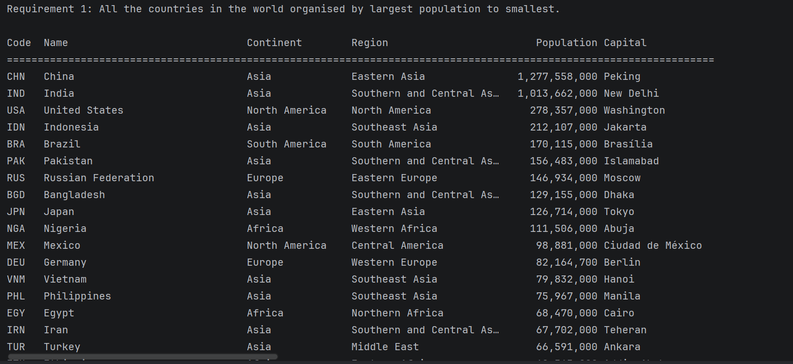 |
| 2 | All the cities in the world organised by largest population to smallest.                                        | Yes | 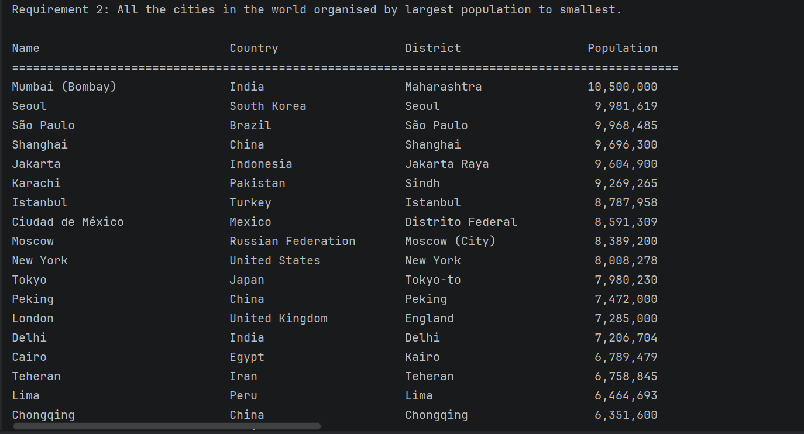 |
| 3 | All the capital cities in the world organised by largest population to smallest.                                | Yes | 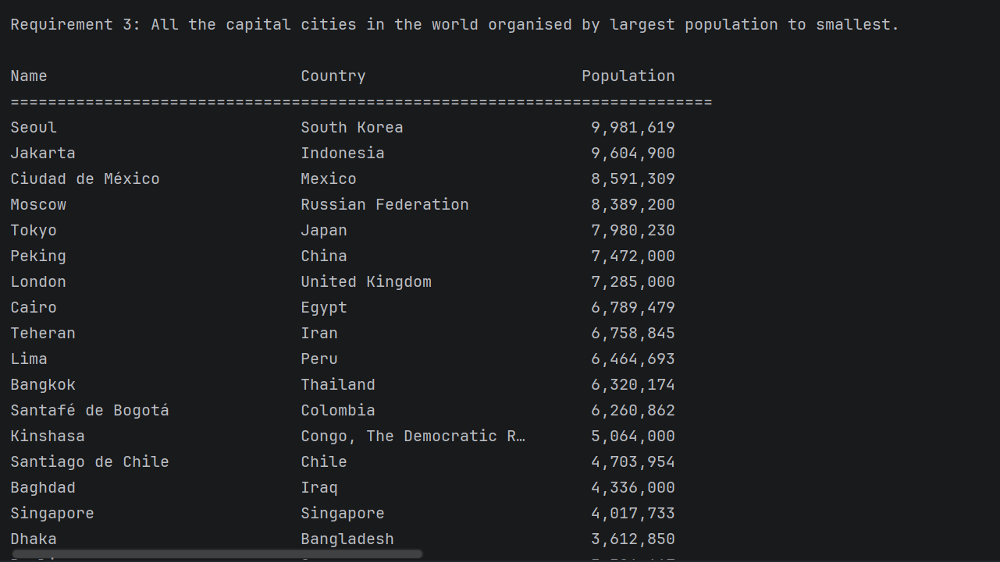 |
| 4 | The top N populated cities in the world where N is provided by the user.                                        | Yes | 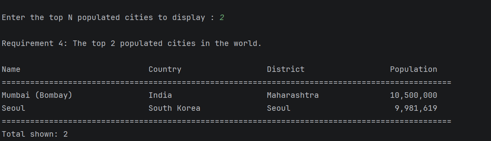 |
| 5 | The population of people, people living in cities, and people not living in cities in each country.             | Yes | 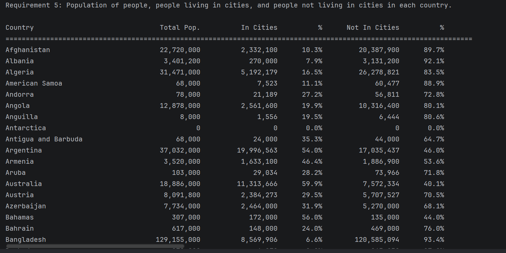 |
| 6 | Population accessible for world, continent, region, country, district, and city.                                | Yes | 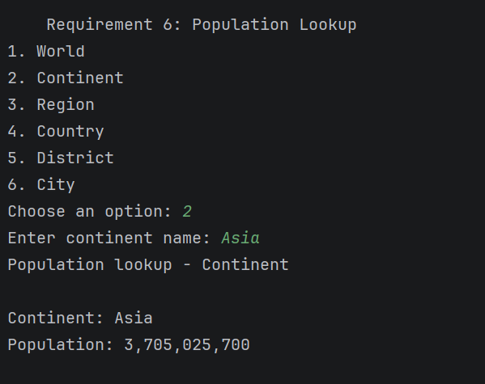 |
| 7 | Number of speakers of Chinese, English, and Spanish, greatest to smallest, with percentage of world population. | Yes | 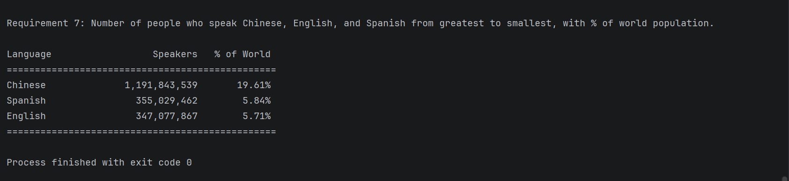 |
| 8 | Update README with screenshots and evidence of each requirement being met.                                      | Yes | 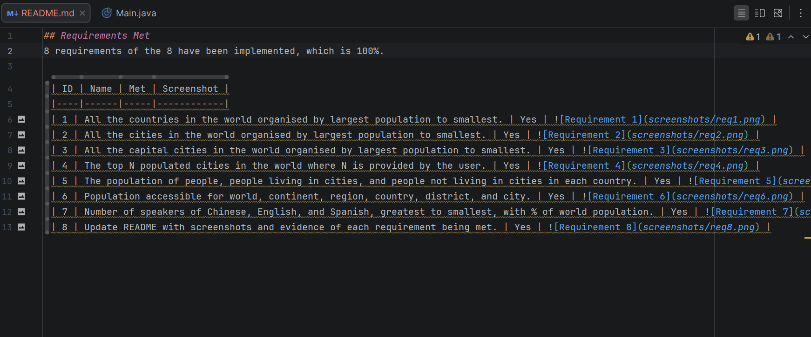 |

## Testing
Unit tests are located in `src/test/java` and cover:
- `Country` and `City` model classes.
- `PopulationReport` calculations (in-city/non-city population, percentages, divide-by-zero and negative-value guards)
- Sorting logic (countries/cities by population, descending)
- Top N selection logic
### Test Results
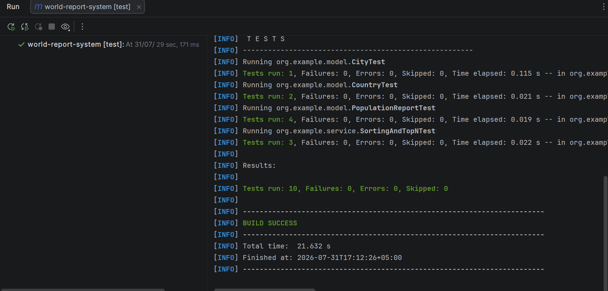

## Integration Testing
Integration tests are located in `src/test/java/org/example/dao`.
Coverage includes:
- `CountryRepositoryIT` — non-empty results, correct descending population order, sanity check on China's population
- `CityRepositoryIT` — non-empty results, Top N returns the exact count requested, results sorted descending
- `PopulationRepositoryIT` — world population is positive, continent population is less than world total, unknown country returns zero safely
### Test Results
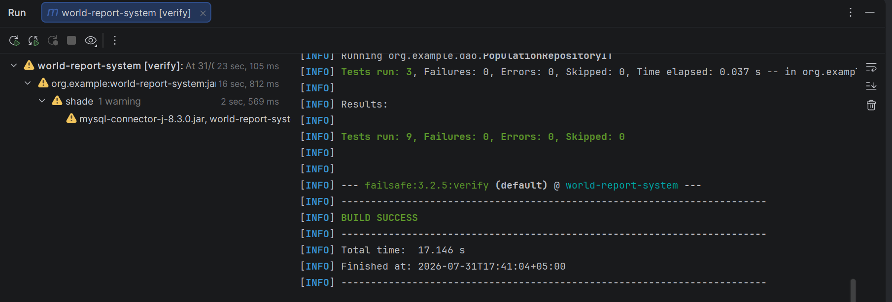
## Use Case Diagram
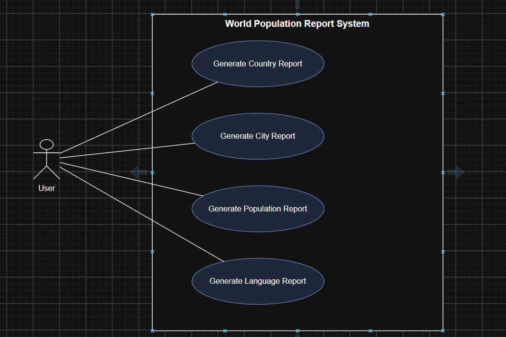